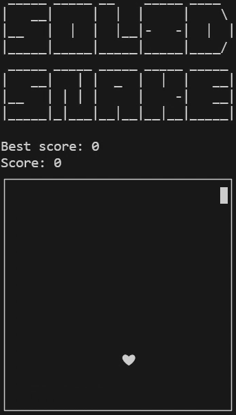

# Solid Snake

## Table of contents

<details>
    <summary>
        CLICK TO ENLARGE 😇
    </summary>
    <a href="#description">Description</a>
    <br>
    <a href="#objectives">Objectives</a>
    <br>
    <a href="#tech-stack">Tech stack</a>
    <br>
    <a href="#files-description">Files description</a>
    <br>
    <a href="#installation_and_how_to_use">Installation and how to use</a>
    <br>
    <a href="#whats-next">What's next?</a>
    <br>
    <a href="#thanks">Thanks</a>
    <br>
    <a href="#authors">Authors</a>
</details>

## <span id="description">Description</span>

Solid Snake is a classic C implementation of the snake game, inspired by this [ASMR programming video](https://www.youtube.com/watch?v=cUJE10XEjrU).

The game features a growing snake that consumes apples while avoiding collisions with itself.

## <span id="objectives">Objectives</span>

- Developed an enjoyable implementation of the classic Snake game in C, playable in a Terminal.
- Implemented core game mechanics, including:
    - Snake movement.
    - Apple generation.
    - Snake growth upon eating an apple.
    - Collision detection.
    - Scoring system.
- Ensured the code adhered to the Betty coding standard for improved readability and consistency.
- Demonstrated and confirmed proficiency in C programming through this project.

## <span id="tech-stack">Tech stack</span>

<p align="left">
    
    
    
    
    
    
</p>

## <span id="files-description">Files description</span>

| **FILES**              | **DESCRIPTION**                                     |
| :--------------------: | --------------------------------------------------- |
| `assets`               | Contains the resources required for the repository. |
| `main.h`               | Header file with structure and function prototypes. |
| `main.c`               | Entry point of the program, contains the main loop. |
| `disable_canonical.c`  | Disables canonical mode for Terminal input.         |
| `print_game_title.c`   | Prints the game title ASCII art.                    |
| `print_playground.c`   | Prints the playground of the game.                  |
| `generate_snake.c`     | Generates and moves the snake in the game.          |
| `get_keyboard_input.c` | Gets keyboard input for controlling the snake.      |
| `generate_apple.c`     | Generates the apple's position in the game.         |
| `print_game_over.c`    | Prints the game over message when the game ends.    |
| `best_score.c`         | Handles reading and writing the best score.         |
| `README.md`            | The README file you are currently reading 😉.      |

## <span id="installation_and_how_to_use">Installation and how to use</span>

### Installation:

1. Clone this repository:
    - Open your preferred Terminal.
    - Navigate to the directory where you want to clone the repository.
    - Run the following command:

```
git clone https://github.com/fchavonet/c-solid_snake.git
```

2. Open the repository you've just cloned.

3. Compile the source code:

```
gcc *.c -o solid_snake
```

### How to use:

1. Run from your Terminal:

```
./solid_snake
```

### How to play:

1. QWERTY
    - Up: `w`.
    - Right: `d`.
    - Down: `s`.
    - Left: `a`.
    - Quit: `esc`.

2. AZERTY
    - Up: `z`.
    - Right: `d`.
    - Down: `s`.
    - Left: `q`.
    - Quit: `esc`.

<br>

<p align="left">
    
</p>

## <span id="whats-next">What's next ?</span>

- Clean and optimize code.

## <span id="thanks">Thanks</span>

- A big thank you to [Serene Dev](https://github.com/serene-dev) for his ASMR video and to [Holberton School](https://www.holbertonschool.com/) for providing a solid foundation in C programming.

## <span id="authors">Authors</span>

**Fabien CHAVONET**
- GitHub: [@fchavonet](https://github.com/fchavonet)
